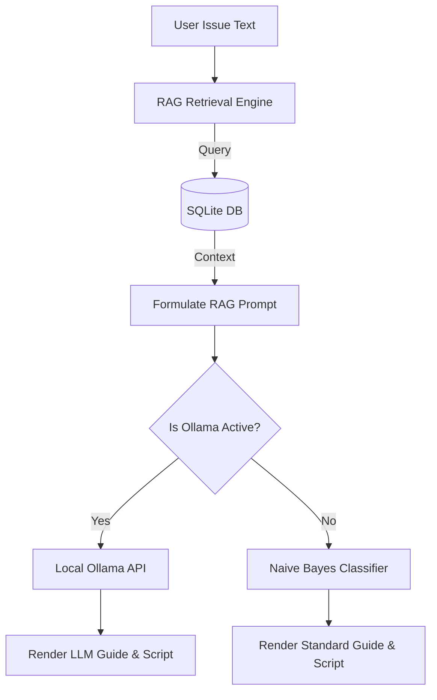

# 🖥️ Advanced Local LLM-Powered IT Helpdesk (Ollama & RAG)

[](https://github.com/TamNguyenmeomeo/10_ai_it_support_assistant/actions/workflows/ci.yml)
[](https://opensource.org/licenses/MIT)
[](https://tam-ai-support.streamlit.app)

An advanced, offline-first IT Helpdesk triage and resolution web application built with **Streamlit**, **SQLite**, and **Ollama**. It implements a Retrieval-Augmented Generation (RAG) pipeline to fetch similar resolved issues from a local knowledge base (1,213 tickets) and queries a local Large Language Model (LLM) to diagnose tickets and write PowerShell recovery scripts.

---

## 🎨 User Interface Preview

### Dark Mode (Giao diện Tối)
The dark theme uses deep navy slate gradients for the background, with translucent glass cards and high-contrast text for a premium look:


### Light Mode (Giao diện Sáng)
The light theme uses bright slate gray gradients and dark text for optimal readability:


---

## 🌟 Key Features

*   **Retrieval-Augmented Generation (RAG):** Queries a local SQLite database using TF-IDF text similarity to find past matching issues and supplies them as prompt context.
*   **Local LLM Integration:** Interfaces with the local **Ollama** API running models like `my-it-assistant` or `qwen2.5-coder:7b` to write highly customized resolution scripts.
*   **Bilingual interface:** Instantly toggle the UI between English and Tiếng Việt.
*   **Dynamic Theme Toggle:** Switch between a glassmorphic Light Mode and Dark Mode inside the app.
*   **Robust Fallback Pipeline:** If the local Ollama service is offline, the app dynamically falls back to an offline Scikit-Learn Naive Bayes classifier.

---

## 📘 Detailed End-User Guide & Explanation

This application is designed to behave like a **"smart virtual IT colleague"** sitting next to you to help diagnose and resolve computer issues. Here is a simple, detailed guide on how it works:

### 1. How the AI IT Assistant Diagnoses Issues
When you experience any computer problem (e.g., *"Cannot connect to Wi-Fi"*, *"Printer paper jam"*, or *"Windows blue screen error"*), you describe it in plain English or Vietnamese.
*   **Searching Past IT Experience (RAG):** The system does not guess. First, it searches a **local database of 1,213 past real-world IT support tickets** to find cases that match your problem description.
*   **Generating Custom Solutions (Local LLM):** Using the retrieved historical cases as context, it feeds the information to a Local AI Model (running on your machine) to write a step-by-step troubleshooting guide tailored to your hardware and OS.
*   **Automatic Fix Scripts:** The AI automatically writes ready-to-run code snippets (like Windows PowerShell or Linux Bash scripts) so that you can fix the issue by simply copying and running the command.

### 2. Benefits of Running Coconuts-Local (Local AI)
*   **100% Data Privacy:** The AI runs entirely on your local machine via Ollama. It does **not require internet connectivity**, and your system logs, passwords, and sensitive company information are never uploaded to the cloud (unlike ChatGPT or Claude).
*   **Offline Mode:** If your network goes down completely, you can still open this app to troubleshoot network adapters, routers, or other offline issues.

### 3. Smart Fallback Mechanism
*   If your system lacks a dedicated GPU or Ollama is not running, the dashboard automatically falls back to a **lightweight machine learning model** (Naive Bayes).
*   This backup system classifies your issue into major categories (Hardware, Network, OS, Software) and provides a standard, offline checklist of troubleshooting steps.

### 4. Step-by-Step Usage Guide
1.  **Describe the Problem:** In the main text area, enter the computer issue you are experiencing.
2.  **Read the Instructions:** Review the clear diagnostic steps provided by the AI.
3.  **Run the Script:** If the AI generates a repair script (e.g., to clear the printer spooler or reset the IP stack), copy the script and run it in your computer's terminal (e.g., PowerShell as Administrator).

---

## 🏗️ Architecture Design



---

## 💻 Local Setup & Execution Guide

### Step 1: Install Dependencies
Open your terminal in this directory and install the required packages:
```bash
pip install -r requirements.txt
```

### Step 2: Set up Local LLM (Ollama)
1.  Download and install [Ollama](https://ollama.com/).
2.  Launch Ollama and pull or build your model:
    ```bash
    ollama run my-it-assistant
    ```

### Step 3: Run the Web Dashboard
Start the local server:
```bash
streamlit run app.py
```
Open your browser at `http://localhost:8501`.

---

## 🧪 Running Unit Tests
To verify database integrity and RAG matching logic, run:
```bash
python -m unittest tests/test_app.py
```

---

## 📄 License
This project is licensed under the MIT License - see the [LICENSE](LICENSE) file for details.
