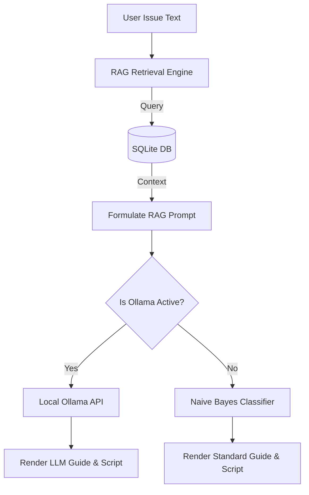

# 🖥️ Advanced Local LLM-Powered IT Helpdesk (Ollama & RAG)

An advanced, offline-first IT Helpdesk triage and resolution web application built with **Streamlit**, **SQLite**, and **Ollama**. It implements a Retrieval-Augmented Generation (RAG) pipeline to fetch similar resolved issues from a local knowledge base and queries a local Large Language Model (LLM) to diagnose tickets and write PowerShell recovery scripts.

---

## 🌟 Key Features

*   **Retrieval-Augmented Generation (RAG):** Queries a local SQLite database using TF-IDF text similarity to find past matching issues and supplies them as prompt context.
*   **Local LLM Integration:** Interfaces with the local **Ollama** API running models like `llama3.1:8b` or `qwen2.5-coder:7b` to write highly customized resolution scripts.
*   **Robust Fallback Pipeline:** If the local Ollama service is offline, the app dynamically falls back to an offline Scikit-Learn Naive Bayes classifier.
*   **CSV Database Ingestor:** Includes `ingest_dataset.py` to index custom Kaggle Helpdesk CSVs into the SQLite database.

---

## 🏗️ Architecture Design



---

## 💻 Local Setup & Execution Guide

### Step 1: Install Dependencies
Open your terminal in this directory and install the required packages:
```bash
pip install -r requirements.txt
```

### Step 2: Initialize the Knowledge Base Database
Seed the local SQLite database using the ingestion script:
```bash
python ingest_dataset.py
```
*(If you have downloaded custom Kaggle datasets from `Ref.txt`, copy the CSV file into this directory before running this command, and it will be indexed automatically).*

### Step 3: Set up Local LLM (Ollama) - Optional
1.  Download and install [Ollama](https://ollama.com/).
2.  Launch Ollama and pull your desired model in the command terminal:
    ```bash
    ollama pull qwen2.5-coder:7b
    ```

### Step 4: Run the Web Dashboard
Start the local server:
```bash
streamlit run app.py
```
Open your browser at `http://localhost:8501`. If Ollama is running in the background, the sidebar will show **Ollama Status: ONLINE** and let you select the loaded model!
